# Hi 👋, I'm Abdul Kareem

**I'm a self-hosting enthusiast and Arch Linux power user (iusearchbtw). I enjoy building efficient workflows, automating tasks with Python, and exploring open source tools — from minimalist Neovim configs to full-blown homelab setups. I like having full control over my systems.**

## 🔭 I'm currently working on

- Building my personal portfolio [site](https://abdulkareem.codes)
- Running my personal dev [blog](https://abdulkareem.is-a.dev)
- An E-Commerce Website [Ayak](https://ayak-storefront.pages.dev)

## 🌱 I'm currently learning

- Hardening self-hosted setups (security, backups, access control)
- Managing infrastructure with automation tools
- Improving frontend skills for a better personal web presence

## 👀 I'm interested in

Self-hosting and privacy-respecting tools
Minimalist, keyboard-driven workflows
Automation and scripting with Python
Open source software and indie web projects

## 📊 GitHub Stats

<!-- ⚠️ Important: Replace 'abdulkareemakn' with your actual GitHub username in the URL below -->

  

## 🔝 Most Used Languages

<!-- ⚠️ Important: Replace 'abdulkareemakn' with your actual GitHub username in the URL below -->

  

## 🔥 Contribution Streak

<!-- ⚠️ Important: Replace 'abdulkareemakn' with your actual GitHub username in the URL below -->

  

## 💻 Tech Stack

### ⚙️ Backend

 

### 🚀 DevOps

  

### 💬 Languages

     

## 🌐 Socials

   

## 📫 How to Reach Me

- 📧 Email: [me@abdulkareem.codes](mailto:me@abdulkareem.codes)

---
⭐️ From [Abdul Kareem](https://github.com/abdulkareemakn)

<!-- Profile views counter -->

  

