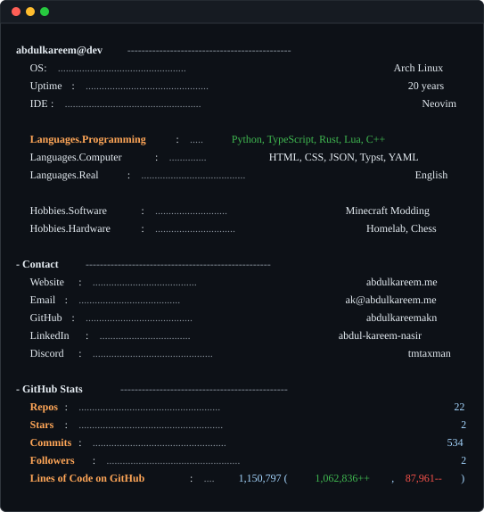

# Hi, I'm Abdul Kareem

**TypeScript and Python developer who likes owning the whole stack — from the code to the homelab it runs on.**

## 📊 GitHub Stats

  

## 💻 Tech Stack

### 👨‍💻 Languages

   

### 🧰 Tools

   

## 🔥 Contribution Streak

  

## 🌐 Elsewhere

   

## 📫 How to reach me

- 📧 Email — [ak@abdulkareem.me](mailto:ak@abdulkareem.me)
- 🌐 Website — [abdulkareem.me](https://abdulkareem.me)
- 📝 Blog — [abdulkareem.is-a.dev](https://abdulkareem.is-a.dev)
- 💬 Discord — `tmtaxman`
