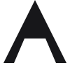

# Hi, I'm Abdul Kareem

**TypeScript and Python developer who likes owning the whole stack — from the code to the homelab it runs on.**

## 📊 GitHub Stats

  

## Tech Stack

### Languages

   

### Frontend & UI

   

### Backend & APIs

  

### DevOps

  

### Cloud & Hosting

     

### Editor & Terminal

   

### Tooling

          

### Everything Else

     

## 🔥 Contribution Streak

  

## 📬 Contact / Links

  
  
  
  
  
  

